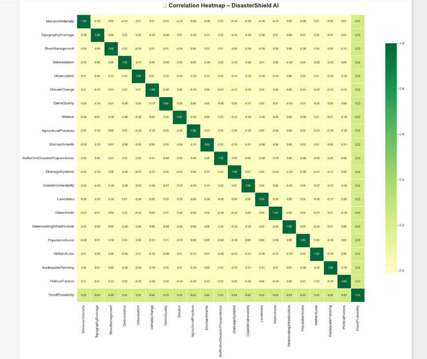
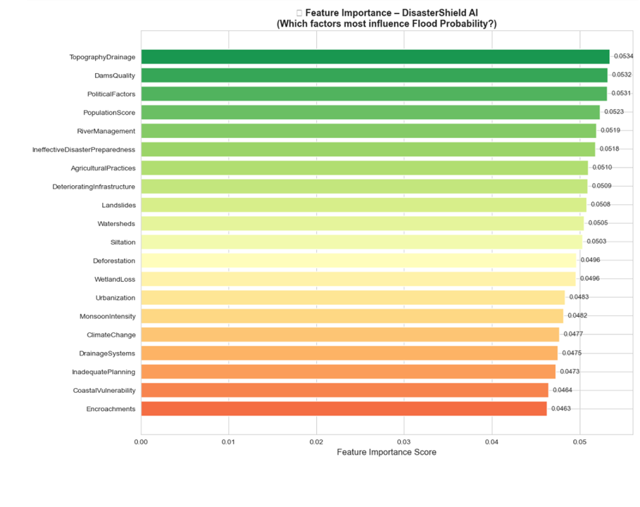

# 🌊 DisasterShield AI

## AI-Powered Flood Risk Prediction System

DisasterShield AI is a Machine Learning project designed to predict flood risk using environmental, infrastructural, and climatic factors. The system analyzes multiple flood-related indicators and estimates flood probability to support disaster preparedness and risk assessment.

## Problem Statement

Floods are among the most devastating natural disasters worldwide. Early identification of high-risk regions can help authorities improve disaster planning and resource allocation.

## Dataset

The project uses a flood prediction dataset containing factors such as:

* Monsoon Intensity
* Topography Drainage
* River Management
* Deforestation
* Urbanization
* Climate Change
* Dams Quality
* Drainage Systems
* Population Score
* Wetland Loss
* Political Factors

Target Variable:

* Flood Probability

## Machine Learning Workflow

1. Data Preprocessing
2. Exploratory Data Analysis
3. Correlation Analysis
4. Feature Engineering
5. Train-Test Split
6. Random Forest Regression
7. Model Evaluation
8. Risk Prediction

## Technologies Used

* Python
* Pandas
* NumPy
* Matplotlib
* Seaborn
* Scikit-Learn
* Joblib

## Model Performance

* Random Forest Regressor
* R² Score: 71.08%

## Features

* Flood probability prediction
* Risk classification
* Data visualization
* Feature importance analysis
* Model persistence using Joblib

## Future Enhancements

* Web Dashboard
* Real-Time Weather Integration
* Geographic Risk Mapping
* Government Alert System
* Disaster Analytics Platform

* ## Project Visualizations

### Correlation Heatmap

### Feature Importance

## Author

Siri Vennela
B.Tech Information Technology
